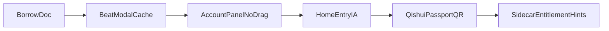

# Mineradio → Lyra：节奏分析 / 账号 UI / 入口页迁移分析

> 日期：2026-08-24（仅核对上游；上次增量核查 2026-08-01；原稿 2026-07-29）  
> 参考仓：`.temp/Mineradio` @ **v2.1.0** / `89c0d23`（相对 `96091d1` 仅 README；**无产品代码增量**）  
> 产品仓：happy-player / Lyra  
> 许可：Mineradio GPL-3.0；Lyra AGPL-3.0 — 移植需保留 NOTICE / 归因，勿整包粘贴未审依赖  

产品决策（既有）：Lyra = **Mineradio 舞台质感 + Folia 设置分层**；只吸收优点；冲突保留 Lyra 默认与性能策略。

相关记忆 / 文档：

- `docs/folia-major-borrow-analysis.md`（Omni / 酷狗 = 只学架构）
- `docs/adr/0001-preanalysis-rhythm-detection.md`（预分析优先）
- memory：`happy-player-mineradio-port-gaps.md`

## 1. 关系与版本差

| 能力 | Mineradio **2.1.0** | Lyra 现状 |
|---|---|---|
| 离线 BeatMap / 电影镜头 | 有 + 本地 MR/DJ 弹窗 + 磁盘缓存 | 引擎 + **弹窗/缓存/命令面板已落地** |
| 长轨 / DJ 分析 | `analyzePodcastDjBeats` + DJ 视觉驱动 | `podcastDjBeatMap` + 用户选模 UI（LocalBeatAnalysis） |
| 多源搜索播放 | 网易/QQ/酷狗/汽水/Spotify | Sidecar：网易/QQ/汽水/酷狗/…；**无 Spotify** |
| 账号接入 UI | 列表 +「展示」+ QR/CK；汽水改为 **Passport Web QR** | **统一账号面板**（无拖拽）；汽水尚无 Passport QR |
| 本地曲库持久化 | 新 `desktop/local-music-library.js` | 已有 local library；可对照崩溃恢复，勿换引擎 |
| 入口页 | Home Dashboard（时钟、Daily Mix、平台推荐、Hero MP4） | `HomeDiscoveryRail`（Daily Mix + Platform Picks）已对齐主结构 |

---

## 1.1 v2.1.0 增量（相对 v2.0.3 / `411bce4`）

相对 `411bce4` → `96091d1`（1 个 release commit，**57 files**）。CHANGELOG 偏笼统；代码 diff 更有信息量。

### 高价值（可开专题）

| 项 | 上游 | 方式 | 说明 |
|---|---|---|---|
| **汽水 Passport Web QR** | 新增 `qishui-auth-v6/`、`qishui-qr-login.js`、`qishui-auth-v6.js`；**删除** `desktop/qishui-local-session-discovery.js` | **只学架构 / 谨慎适配移植** | 归因见 `docs/THIRD_PARTY_PORTS.md` → `Wx2yZx/Mineradio-Qishui-QR-Login`（GPL-3.0）。协议资源版权敏感；须隔离 Electron partition；**勿整包粘贴** `qishui-auth-v6` 进主渲染。桥接目标：官方登录 cookie → Lyra sidecar |
| **三源登录/权益边界硬化** | `kugou-api.js` + `tests/kugou-vip-hardening.test.js`；`qq-vip-api.js`；`qishui-api.js` + `qishui-tier-rights` / passport 单测 | **只学架构** | 对照 sidecar / 账号 entitlement 提示（P2）；勿整包替换 `*-api.js` |
| **本地曲库持久化** | `desktop/local-music-library.js` + `tests/local-music-library-persistence.test.js` | **只学架构** | Lyra 已有本地库；对照索引持久化与崩溃恢复即可 |

### 可抽查的稳定性点

- 连续播放 / 启动 readiness：`tests/startup-navigation-readiness.test.js`、`13-playback-start-audio.js`
- main-window runtime recovery：`tests/main-window-runtime-recovery.test.js`
- 账号 modal 状态机：`08-account/*` — Lyra 统一面板已落地，只对照边界文案与失效清理

### 本增量明确不做

| 项 | 原因 |
|---|---|
| Wallpaper Engine / Full Desktop | Windows 专属（既有「不做」） |
| 登录彩蛋门禁改动 | 既有「不做」 |
| Spotify | 既有「不做」 |
| 整包替换 `server.js` / 各 `*-api.js` | Lyra 架构是 sidecar，不是 MR Node 单体 |
| 汽水本地 cookie 发现 | **上游已删除**；勿再按旧路径实现 |

### 建议的下一刀（增量后）

1. 汽水 **Passport QR → sidecar cookie** 专项研究（产品/合规评估后再写代码）  
2. sidecar 对照 QQ/酷狗/汽水 entitlement 提示文案与失败边界  
3. 本地库持久化交叉检查（可选）

---

## 2. 迁移方式图例

| 标签 | 含义 |
|---|---|
| **直接 cherry-pick** | 路径/契约接近，改少量 import/store 即可合入 |
| **适配移植** | 可搬交互与逻辑，接 Lyra store / sidecar / Home |
| **只学架构** | 学模式，勿整包粘贴 |
| **不做** | 与定位冲突、运维过重、或 Windows 专属 |

---

## 3. 轨 A — 本地节奏分析产品面

### 3.1 Lyra 已有（勿重做引擎）

| 路径 | 作用 |
|---|---|
| `src/utils/atmosphere/beatMapAnalyzer.ts` + `beatMap/*` | 离线综合节奏（≈ MR） |
| `src/utils/atmosphere/podcastDjBeatMap.ts` | 长轨 / 低频锁拍（≈ DJ） |
| `src/hooks/atmosphere/useAtmosphereBeatMapLoader.ts` | 播放后延迟分析；已接用户选模 + 缓存优先 |
| `src/utils/atmosphere/localBeatMapCache.ts` | BeatMap 持久化 |
| `src/components/modal/LocalBeatAnalysisModal.tsx` + `useLocalBeatAnalysisStore` | MR / DJ 弹窗 |
| `beatCameraEnvelope` / `cinemaDrift` / `enableSmartAtmosphere` | 镜头与氛围消费端 |
| ADR-0001 | 预分析优先；允许未来持久化 |

### 3.2 Mineradio 上游

| 路径 | 作用 |
|---|---|
| `public/js/modules/03-beat/03-local-beat-cache-modal.js` | 弹窗、模式选择、缓存读写、开始/取消/暂不分析 |
| `public/index.html` `#local-beat-modal` | MR / DJ 双 Tab UI |

### 3.3 候选

| 项 | 方式 | 说明 |
|---|---|---|
| MR / DJ 二选一弹窗 +「暂不分析」 | **已落地** | `LocalBeatAnalysisModal` |
| BeatMap 按 `songKey + mode` 持久化 | **已落地** | `localBeatMapCache` |
| 分析中状态 / toast | **已落地（基本）** | 可继续 polish |
| 命令面板「分析节奏 MR/DJ」 | **已落地** | `open-local-beat-analysis` |
| Cuefield Automix | **不做（本轮）** | 重、默认关；另立产品面 |

### 3.4 接入点（实现）

- Loader：扩展 `useAtmosphereBeatMapLoader` 或旁路 store，支持「用户选模 + 读缓存优先」— **已接线**
- UI：`LocalBeatAnalysisModal`
- 存储：本地缓存层（体积大时优先 IDB）
- **不进**外观导入导出；进 command palette

---

## 4. 轨 B — 多渠道账号配置 UI（无拖拽）

### 4.1 Lyra 已有

| 路径 | 作用 |
|---|---|
| `services/musicProviders/*` + sidecar | 多源搜索 / 播放 |
| `useNeteaseQrLogin` / `NeteaseAccountCard` | 网易扫码 |
| `useQQMusicLogin` / `QQMusicLoginPanel` | QQ 扫码 + Cookie |
| `UnifiedMusicAccountsPanel` / `PeerFreeAccountDetail` | 统一账号列表 + 详情 |
| `OnlineMusicGuestConnect` | 首页未登录引导（可再深链统一面板） |
| `useOnlineLibraryFilterStore` | 源开关 / 搜索频道 /「展示」 |
| Folia borrow | 「Omni provider = 只学架构」 |

### 4.2 Mineradio 上游（要学什么 / 不要什么）

| 要学 | 不要 |
|---|---|
| 平台列表（NE/QQ/KG/QS…）+ 登录态文案 | **拖接口到 MR 的节点图** |
| 「展示」开关（控制右上角/入口可见） | 「世界和平」登录彩蛋门禁 |
| QR / Cookie 分流按钮与状态机 | Spotify OAuth 整包 |
| 统一「登录接入」标题与一处收口 | Windows 专属会话路径硬编码 |
| **汽水 Passport Web QR 桥接模式**（隔离 partition → cookie → provider） | 整包 `qishui-auth-v6` 进主窗口；本地 cookie 扫描（已删除） |

上游主要文件：`public/js/modules/08-account/*`、`index.html` `#login-modal`；汽水认证：`qishui-qr-login.js`、`qishui-auth-v6.js`、`qishui-auth-v6/`。

### 4.3 候选

| 项 | 方式 | 说明 |
|---|---|---|
| 统一账号接入面板（列表 + 展示 + QR/CK） | **已落地** | 点击选平台，右侧出认证区；**无拖拽** |
| 收拢网易/QQ 到同一面板 | **已落地** | `UnifiedMusicAccountsPanel` |
| 「展示」↔ filter / 胶囊可见 | **已落地** | `playlistProviders` |
| **汽水 Passport QR → sidecar** | **只学架构 / 谨慎适配移植** | 取代旧「本机会话发现」；须合规评估 + 隔离 partition；另开专项 |
| Provider entitlement 提示 | **适配移植**（P2） | 对照 v2.1.0 三源 hardening 单测与文案 |
| Spotify / 酷狗完整登录 | **不做（本轮）** | 与 vinyl / Folia 结论一致 |

---

## 5. 轨 C — 入口页（Home Dashboard）

### 5.1 Mineradio 上游

| 路径 | 作用 |
|---|---|
| `public/js/modules/05-playback/03a-home-dashboard.js` | Dashboard 数据与交互 |
| `public/index.html` `#empty-home` | 时钟/文案、Daily Mix、PLATFORM PICKS、选 MP4、展开播控 |
| `docs/THIRD_PARTY_PORTS.md` | LX-Music IA + **Qishui Passport Web QR** 归因 |

### 5.2 Lyra 已有

| 路径 | 作用 |
|---|---|
| `src/components/Home.tsx` / app home | tab 路由（local/history/daily/podcast/…） |
| `HomeDiscoveryRail` + `HomeDailyMixEntry` + `HomePlatformPicksEntry` | 默认入口推荐 / 平台入口 |
| `DailyRecommendSurface` + `dailyRecommendService` | 多源每日推荐 |
| `OnlineMusicGuestConnect` | 未登录引导 |
| Legacy `Home.tsx` / Grid3D | 旧入口与网格 |

### 5.3 候选

| 项 | 方式 | 说明 |
|---|---|---|
| 默认入口信息架构：主推荐 + 平台推荐入口 | **已落地** | `HomeDiscoveryRail` |
| 未登录 → 统一账号面板 | **适配移植**（可选后续） | Platform Picks「管理账号」深链 |
| For You / 三曲条、稳定封面换图 | **适配移植** | 低成本体验增量 |
| 每日推荐虚拟列表 | **适配移植** | 长列表性能 |
| Hero 本地 MP4 壁纸 | **缓做** | 可选；非 P0 |
| 天气电台整包 / Full Desktop / WE | **不做** | 产品面过大或 Windows 专属 |

---

## 6. 明确不做

| 项 | 原因 |
|---|---|
| 登录彩蛋「世界和平」 | 预览摩擦；与 Lyra 登录体验冲突 |
| 拖拽节点接线登录图 | 用户明确不需要；Folio/Omni 亦只学架构 |
| Cuefield Automix | 重实现；默认关；另立产品面 |
| Spotify 账号桥 | vinylformac 文档：不做 |
| Wallpaper Engine / Full Desktop | Windows 专属 |
| 重做 beat 引擎 / 换 sidecar | Lyra 已校准 |
| 照搬 coverResolution 1.55 / 后台 keep 默认 | 与性能护栏冲突 |
| 汽水本地 cookie 扫描 | 上游 v2.1.0 已移除；改走 Passport QR 研究 |

---

## 7. 建议落地顺序

1. **P0** 本地 MR/DJ 弹窗 + BeatMap 持久化 + command palette — **已落地**  
2. **P1** 统一账号面板（无拖拽）+ 展示开关 — **已落地**  
3. **P1/P2** 入口页 IA（Daily Mix / 平台推荐）— **主结构已落地**；深链/For You 后续  
4. **P2 / 专项** 汽水 Passport QR → sidecar；entitlement 提示；For You 条、虚拟列表  

## 8. 验收清单（实现时）

**文档**

- [x] 三轨均有上游路径、Lyra 对照、方式标签、为何做/不做  
- [x] 与 Folia borrow / ADR-0001 / port-gaps 无矛盾  
- [x] v2.1.0 增量已记录；汽水路径从「本地发现」改为 Passport QR  

**轨 A**

- [x] 本地曲无缓存可弹出 MR/DJ；「暂不分析」不阻断播放（P0 已落地）
- [x] 同 key+mode 再次播放走缓存（P0 已落地）
- [x] 命令面板可手动触发分析（`open-local-beat-analysis`）

**轨 B**

- [x] 无拖拽；点击选平台 + QR/Cookie（Account 面板统一列表 + 详情）
- [x] 网易/QQ 可从统一面板完成（复用既有卡片）
- [x] 「展示」影响入口/筛选可见性（`playlistProviders`）
- [ ] Guest / Integration 深链到统一面板（可选后续）
- [ ] 汽水 Passport QR → sidecar（专项；取代旧「会话发现」）
- [ ] entitlement 提示（P2；对照 v2.1.0 hardening）

**轨 C**

- [x] 默认 Home 呈现对齐后的推荐 / 平台入口结构（`HomeDiscoveryRail`：Daily Mix + Platform Picks）
- [x] 不破坏现有 tab（local / history / daily / …）；`home-daily` 命令可进完整 DailyRecommendSurface
- [ ] 未登录引导接到统一账号面板（可选：Platform Picks「管理账号」需 panel 回调）
- [ ] Hero 文案/MP4、Listening Today、For You 三曲条（后续）
